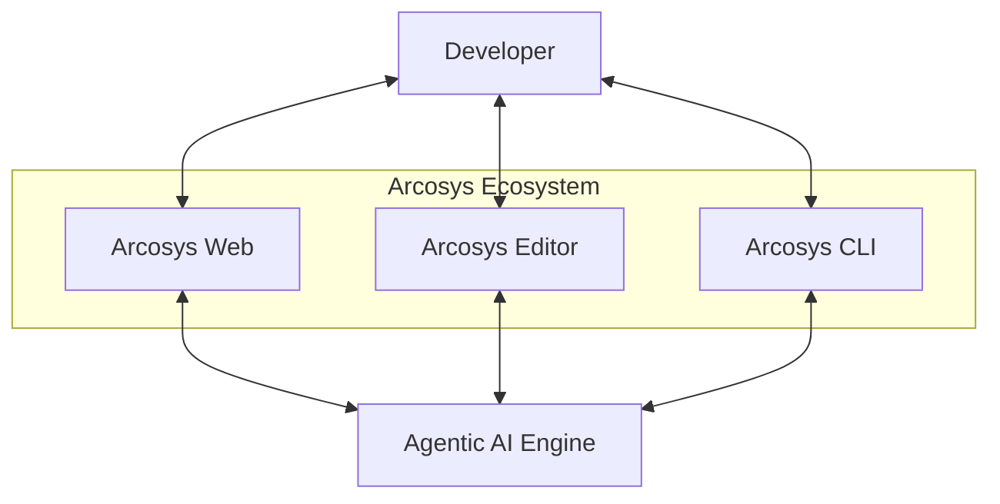

# Arcosys: The Agentic Code Intelligence Platform

Arcosys is a next-generation ecosystem designed to revolutionize the way developers interact with code. It leverages powerful Agentic AI to provide a seamless, intelligent experience across the web, your local editor, and the terminal.

## 🚀 Projects

The Arcosys ecosystem consists of three primary components:

### 🌐 [Arcosys Web](./arcosys-web)
A sophisticated web-based interface for managing pull requests and codebase interactions.
- **Agentic Workflows**: Commit directly to pull requests via AI agents.
- **Interactive AI Chat**: Chat with your codebase and get real-time assistance.
- **AI File Generation**: Create new files and structures using simple natural language prompts.
- **Smart Help**: Get context-aware help and insights into your project.

### 💻 [Arcosys Editor](./arcosys-editor)
An agentic code editor built for the future.
- **AI-Native Experience**: Deeply integrated AI that understands your project's context.
- **Intelligent Refactoring**: Beyond simple autocomplete, it assists in architectural decisions and complex refactorings.

### 🐚 [Arcosys CLI](./arcosys-cli)
A multi-agent capable command-line interface, inspired by tools like Claude CLI.
- **Terminal Agent**: Execute complex commands and manage development tasks directly from the shell.
- **Status**: Currently under active development.

---

## 🏗️ Architecture Overview

---

## 🤝 Contributing

We welcome contributions from the community! Please see our [Contributing Guidelines](CONTRIBUTING.md) and [Code of Conduct](CODE_OF_CONDUCT.md) for more information.

## 👤 Author

**LW Shakib**
- GitHub: [@lwshakib](https://github.com/lwshakib)

---

## 📜 License

This project is licensed under the [MIT License](LICENSE).