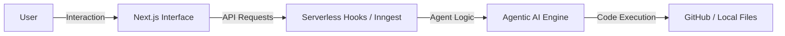

# Arcosys Web

Arcosys Web is the agentic command center for your development workflow. It provides a rich, AI-powered interface for managing repositories, pull requests, and code generation.

## ✨ Key Features

- **Agentic PR Management**: Let AI agents handle the heavy lifting of committing and managing pull requests.
- **Contextual Chat**: Engage in deep conversations with your codebase to understand complex logic or plan new features.
- **AI-Powered File Creation**: Bootstrap entire components or utility files with simple natural language instructions.
- **Intelligent Assistance**: Get instant help with debugging, architectural advice, and code reviews.

## 🛠️ Getting Started

### Prerequisites

- [Bun](https://bun.sh) (recommended) or Node.js (v18+)

### Installation

```bash
bun install
```

### Development

```bash
bun dev
```

Open [http://localhost:3000](http://localhost:3000) with your browser to see the result.

## 🏗️ Architecture



## 👤 Author

**LW Shakib**
- GitHub: [@lwshakib](https://github.com/lwshakib)
